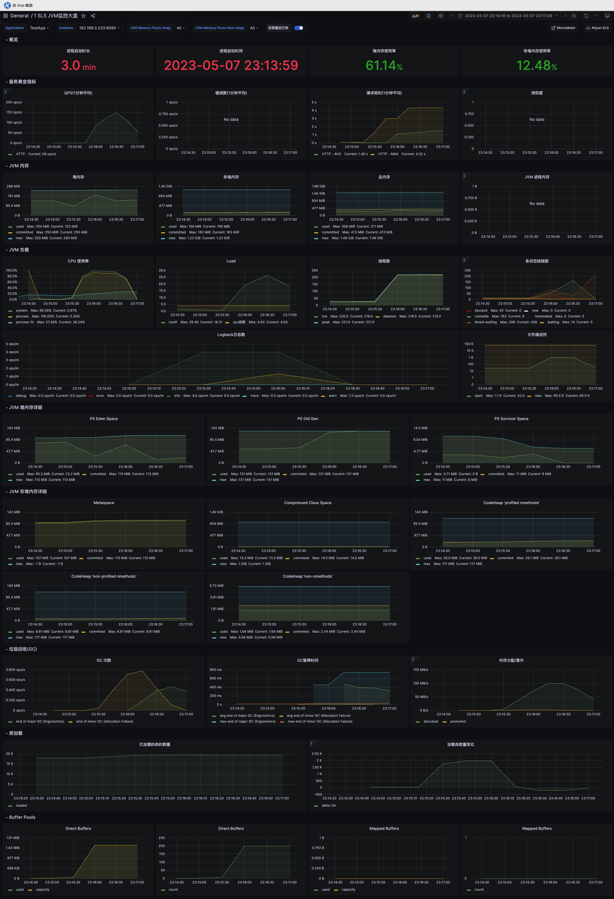
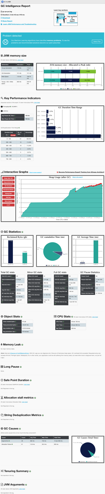
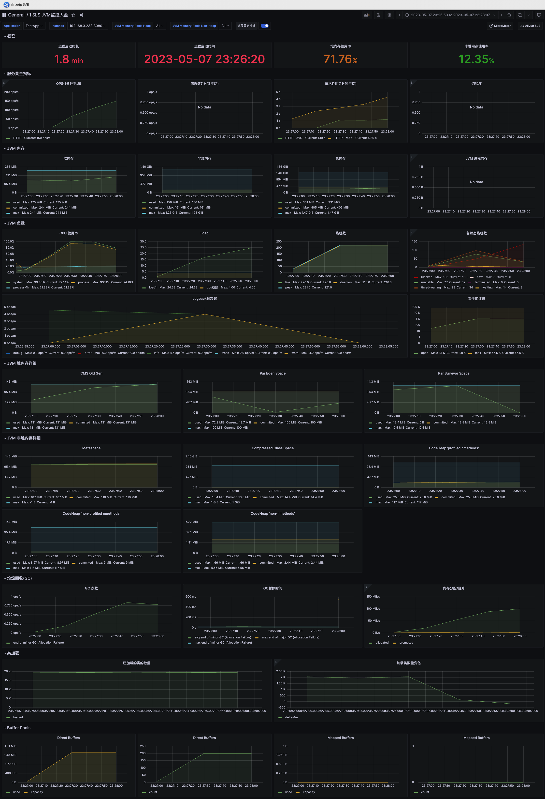
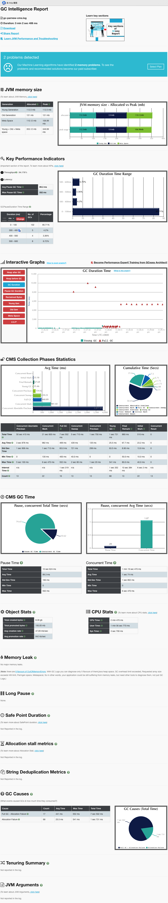
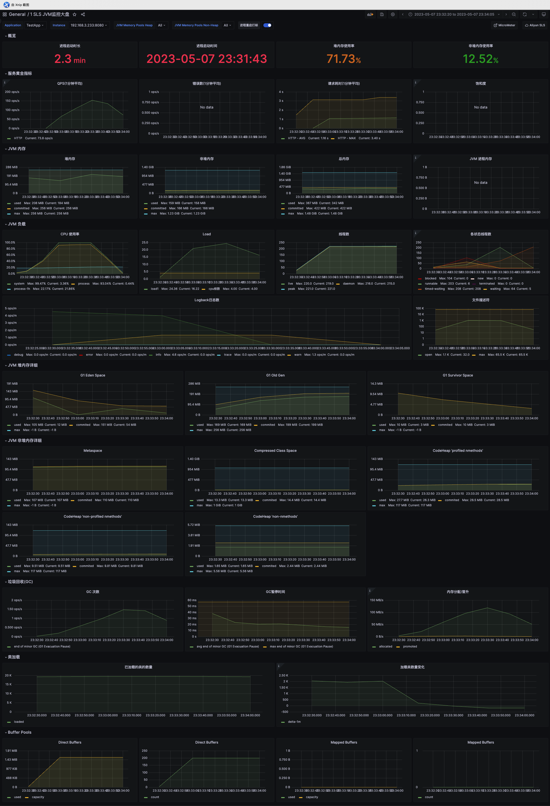
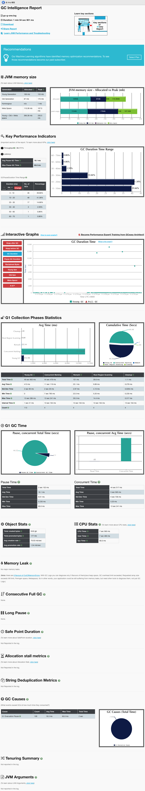

# JVM 虚拟机实践题

## PS + PO

### 参数

```bash
# 吞吐量优先策略：
JAVA_OPT="${JAVA_OPT} -Xms256m -Xmx256m -Xmn125m -XX:MetaspaceSize=128m -Xss512k"
JAVA_OPT="${JAVA_OPT} -XX:+UseParallelGC -XX:+UseParallelOldGC"
JAVA_OPT="${JAVA_OPT} -Xlog:gc*:logs/gc-ps-po.log:time"

java -server ${JAVA_OPT} -jar ./testapp-0.0.4-SNAPSHOT.jar >> ./logs/app-ps-po.log 2>&1 &
```

### Dashboard



### GCEasy



## CMS

### 参数

JDK11已经废弃使用+UseParNewGC参数

```bash
# 响应时间优先策略
JAVA_OPT="${JAVA_OPT} -Xms256m -Xmx256m -Xmn125m -XX:MetaspaceSize=128m -Xss512k"
JAVA_OPT="${JAVA_OPT} -XX:+UseConcMarkSweepGC"
JAVA_OPT="${JAVA_OPT} -Xlog:gc*:logs/gc-parnew-cms.log:time"

java -server ${JAVA_OPT} -jar ./testapp-0.0.4-SNAPSHOT.jar >> ./logs/app-parnew-cms.log 2>&1 &
```

### Dashboard



### GCEasy



## G1

### 参数

```bash
# 全功能垃圾收集器
JAVA_OPT="${JAVA_OPT} -Xms256m -Xmx256m -XX:MetaspaceSize=128m -Xss512k"
JAVA_OPT="${JAVA_OPT} -XX:+UseG1GC -XX:MaxGCPauseMillis=100"
JAVA_OPT="${JAVA_OPT} -Xlog:gc*:logs/gc-g-one.log:time"

java -server ${JAVA_OPT} -jar ./testapp-0.0.4-SNAPSHOT.jar >> ./logs/app-g1.log 2>&1 &
```

### Dashboard



### GCEasy



## 结论

- 三次测试差异不明显，说明能过JVM调优来优化系统确实应该最后考虑的手段。
- 在我的测试环境下，G1GC的效果不错，10000次请求用时最短，并且没有出现FullGC。
- G1和CMS内存使用率差不多，都高于PS+PO